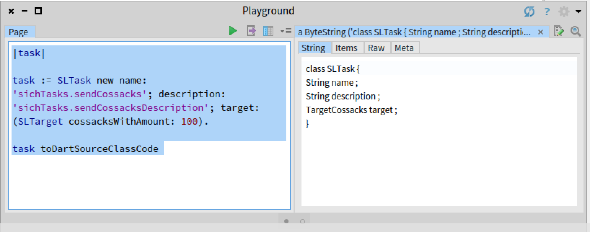

# smalltalk-to-dart

This package extends Object class with following:

- Dart Class Name to be used
```smalltalk
dartSourceClassName
```
- Returns class definition in Dart syntax. Supports super classes as well. Adds all instance variables to the class definition.

```
toDartSourceClassCode
```

- Creates a full string with itself as a property in Dart class
```
toDartSourceCodeWithName: aPropertyName onStream: aStream
``` 


# Usage

Add *dartSourceClassName* method to your class and return a string which should be used as a dart class name. Do it for other classes used in your main class.

Instantiate your class and send *toDartSourceClassCode* message to it.

# Example

Class SLTask has three instance String variables: name, description and target, which is an instance of TargetCossacks class.

```smalltalk
|task|

task := SLTask new name: 'sichTasks.sendCossacks'; description: 'sichTasks.sendCossacksDescription'; target: (SLTarget cossacksWithAmount: 100).

task toDartSourceClassCode 
```

Outputs:


 

